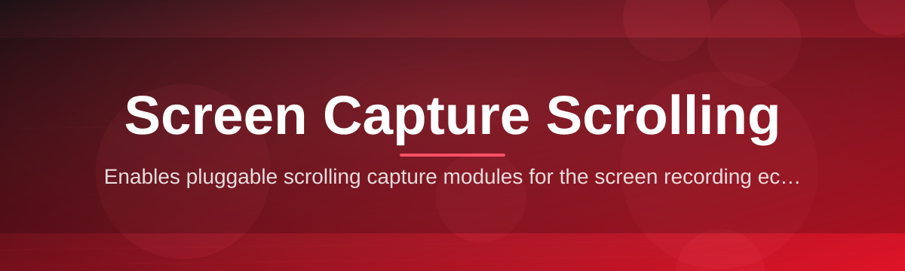
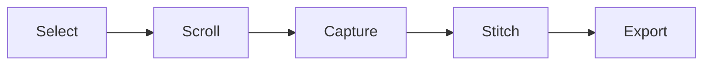

# scr-cap-scroll-tool 📜🖱️

  

*One capture, infinite page — scrolling screenshots that stitch themselves.*

  

---

## 🧭 Overview

Every long webpage, chat log, spreadsheet, or code file eventually outgrows the visible viewport — and the standard screenshot dies right there at the fold. **scr-cap-scroll-tool** exists to kill that limitation. It captures a scrolling region frame-by-frame as you move through content, then stitches every frame into a single seamless image — no crop lines, no duplicated headers, no ghosting artifacts from anti-aliased text.

This tool was built for people who live in documentation, research, QA, and support tickets: the ones who need to hand someone *the whole page*, not six overlapping fragments taped together in Paint. Screen capture scrolling isn't a novelty feature here — it's the entire mission. The engine watches pixel deltas in real time, detects genuine scroll movement versus static noise, and merges frames with sub-pixel alignment so the final export looks like it was rendered in one shot.

Whether you're archiving a long Slack thread, documenting a vertical web app, or capturing an endless spreadsheet for a bug report, this is the difference between "screenshot" and "record." No cloud upload, no account, no telemetry — just a fast native Windows utility that does one job with obsessive precision.

---

## ⚖️ Why Not Just Use...

> [!NOTE]
> Scrolling screen capture is a crowded space full of half-solutions. Here's how this one stacks up.

| Capability | scr-cap-scroll-tool | OS Snip Tool | Browser Extensions | Manual Stitching |
|---|---|---|---|---|
| True scrolling capture | ✅ Native, any app | ❌ Static only | ⚠️ Browser tabs only | ❌ N/A |
| Works outside the browser | ✅ Full desktop | ✅ | ❌ | ✅ |
| Automatic seam detection | ✅ Pixel-diff engine | ❌ | ⚠️ Basic | ❌ |
| Standalone / no install | ✅ Portable EXE | ✅ | ❌ Requires store | ✅ |
| Export formats | PNG, JPG, PDF | PNG only | PNG only | Whatever you can manage |
| Speed for long pages | ✅ Seconds | 🐢 Manual repeats | ⚠️ Varies | 🐢 Painful |
| Offline / no cloud | ✅ 100% local | ✅ | ❌ Often synced | ✅ |

---

## 🚀 Capabilities

- **Seamless auto-stitching** — frames are aligned using pixel-delta matching, not blind cropping, so overlapping headers and sticky navbars vanish cleanly from the final image.

- **Any-window capture** — works on browsers, IDEs, PDF viewers, chat clients, spreadsheets, and terminal windows. If it scrolls, it captures.

- **Adjustable capture speed** — throttle the scroll-and-shoot interval to match slow-rendering pages or fast native apps, avoiding blur and dropped frames.

- **Smart edge trimming** — automatically shaves off duplicate pixel rows at frame boundaries, eliminating the "double line" artifact common in naive stitching tools.

- **Multi-format export** — save as PNG for fidelity, JPG for size, or PDF for shareable documents that read top to bottom like a real page.

- **Region lock** — pin the capture area to a specific window or custom rectangle so accidental cursor drift never clips your output.

- **Live preview strip** — watch the stitched image build in real time during capture, catching scroll glitches before you save instead of after.

- **Zero-footprint operation** — a single portable executable with no background services, no registry sprawl, and no update nags interrupting your capture.

---

## 🏁 Up and Running

> [!TIP]
> No package managers, no terminal commands, no dependency chains. This is a double-click tool.

1. Hit the download button above — it routes to the official landing page.

2. Save the standalone executable anywhere convenient (desktop, USB drive, project folder).

3. Launch it. Windows SmartScreen may prompt once for an unrecognized publisher — click **More Info → Run Anyway**.

4. Select your capture region, start scrolling, and let the stitching engine do the rest.

---

## 🖥️ System Requirements

| Requirement | Details |
|---|---|
| OS | Windows 10 (64-bit) or Windows 11 |
| Dependencies | None — fully self-contained |
| Disk space | Under 50 MB |
| RAM | 4 GB minimum, 8 GB recommended for very long captures |
| Internet | Not required after download |
| Admin rights | Not required for standard use |

> [!IMPORTANT]
> This is a Windows-native build. There is no macOS or Linux binary — cross-platform support is tracked but not guaranteed for this release cycle.

---

## ⚙️ How It Works

The capture pipeline is deliberately simple on the surface and rigorous underneath:

1. **Region select** — you draw or auto-detect the capture boundary.
2. **Scroll trigger** — the tool listens for scroll events (mouse wheel, keyboard, trackpad) inside the region.
3. **Frame sampling** — each scroll tick fires a fast screenshot of the visible region.
4. **Delta stitching** — overlapping pixel rows between consecutive frames are matched and merged.
5. **Export render** — the final composite is flattened and written to your chosen format.

---

## 🧩 Troubleshooting

<strong>My capture has a visible seam or duplicate line — what's happening?</strong>

 

Usually caused by scrolling faster than the sampling interval can keep up. Lower the capture speed setting so each frame has enough pixel overlap for accurate stitching.

<strong>The tool captured a blank or frozen frame partway through.</strong>

 

Some apps use lazy-loading or animated scroll transitions. Pause briefly between scroll actions to let content fully render before the next frame is sampled.

<strong>Windows SmartScreen is blocking the executable.</strong>

 

This is standard behavior for unsigned or newly-released independent tools. Click **More Info → Run Anyway** — the binary is not altered post-build.

<strong>Can it capture inside a virtual machine or remote desktop session?</strong>

 

Yes, but frame rate depends on the remote rendering pipeline. Expect slower capture speeds and lower the sampling rate accordingly.

<strong>My exported PDF looks compressed or blurry.</strong>

 

PDF export applies light compression for file size. Switch to PNG export if pixel-perfect fidelity matters more than file size.

<strong>The stitched image is longer than expected — extra whitespace at the bottom.</strong>

 

This happens when the page hits its scroll limit before you stop capturing. Trim the final frame manually, or stop capture the moment scrolling stalls.

---

## 🎨 UI / UX Details

> [!NOTE]
> Built for keyboard-first workflows — mouse-only users are equally welcome.

**Keyboard shortcuts**

| Action | Shortcut |
|---|---|
| Start / stop capture | `Ctrl + Shift + S` |
| Cancel current capture | `Esc` |
| Toggle live preview | `Ctrl + P` |
| Quick export | `Ctrl + E` |
| Open region selector | `Ctrl + R` |

**Themes** — Light, Dark, and a High-Contrast mode for accessibility. Theme persists across sessions automatically.

**Settings panel** — capture speed, edge-trim sensitivity, default export format, and hotkey remapping all live in one screen — no nested menus.

---

## 🤝 Contributing & Community

Bug reports, feature requests, and pull requests are genuinely welcome — this tool improves because people who hit edge cases speak up.

- Open an issue with your OS build, capture target app, and repro steps.
- Fork, branch, and submit a pull request for fixes or enhancements.
- Discussion threads are the right place for feature debates before code is written.

  

> [!WARNING]
> Please don't file issues asking for platforms outside Windows unless you're volunteering to help build that port — it keeps the backlog focused.

---

## 📄 License

Released under the [MIT License](LICENSE), 2026. Use it, fork it, ship it inside your own workflow — attribution appreciated, not mandatory.

---

## ⚠️ Disclaimer

This tool captures screen content only within regions and applications you explicitly select. Respect copyright, privacy, and platform terms of service when capturing content you don't own. The maintainers assume no liability for misuse, data loss, or capture inaccuracies arising from third-party application behavior.

---

